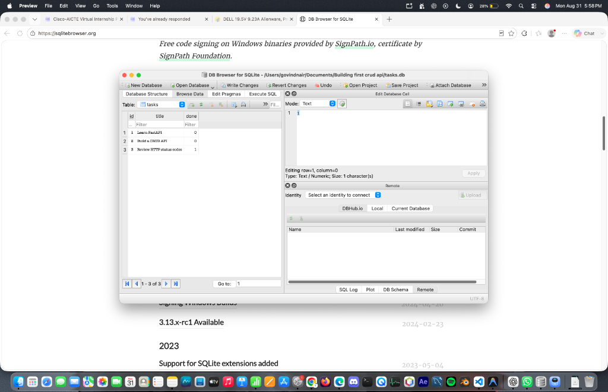

# Task API (`flyrank-task-api`)

A clean, lightweight REST API for managing a to-do list built with **FastAPI**, **Uvicorn**, **Pydantic**, and **SQLite** (`sqlite3`). Built for the FlyRank Internship Backend AI Engineering Track (Week 3, Assignment A2).

---

## 📌 Project Overview

This project builds directly on Assignment A1 by replacing transient in-memory Python list storage with a persistent **SQLite** database (`tasks.db`). The API adheres strictly to REST conventions, utilizes parameterized SQL queries for security, and maintains standard HTTP status codes.

### 🔄 Evolution from A1 to A2
- **Assignment A1**: Data was held in a temporary in-memory Python list (`tasks = [...]`) and was lost whenever the server restarted.
- **Assignment A2**: Data is persisted in a local SQLite database (`tasks.db`). All CRUD operations execute raw SQL queries via Python's standard `sqlite3` library. Data persists across server restarts.

---

## 💡 Why SQLite?

1. **Single-file Database**: The entire database lives in a single local file (`tasks.db`), making it portable and easy to inspect.
2. **Zero Configuration**: No standalone database server (like PostgreSQL or MySQL) is required. Python includes `sqlite3` in the standard library.
3. **Data Persistence**: Created, updated, and deleted tasks survive server restarts without external infrastructure overhead.

---

## 🗄️ Database Architecture & Initialization

- **Database File**: `tasks.db` (auto-created in the workspace root on startup).
- **Schema**:
  ```sql
  CREATE TABLE IF NOT EXISTS tasks (
      id INTEGER PRIMARY KEY AUTOINCREMENT,
      title TEXT NOT NULL,
      done INTEGER NOT NULL DEFAULT 0
  );
  ```
  *(Note: SQLite stores `done` as `0` for false and `1` for true; the API converts this to standard boolean values in JSON).*

- **Automatic Seeding**:
  On startup, the application verifies `SELECT COUNT(*) FROM tasks`. If empty, it seeds exactly 3 default tasks:
  1. `"Learn FastAPI"` (`done: false`)
  2. `"Build a CRUD API"` (`done: false`)
  3. `"Review HTTP status codes"` (`done: true`)
  Subsequent restarts detect existing records and do **not** duplicate seed data.

- **Git Ignored**:
  `tasks.db` is specified in `.gitignore` so each clone automatically generates its own isolated database instance upon launch.

---

## 🛡️ Database Safety (Parameterized Queries)

To prevent SQL injection vulnerabilities, all dynamic SQL queries use parameterized placeholders (`?`) rather than string interpolation:

```python
# Safe parameterized query example
cursor.execute("SELECT id, title, done FROM tasks WHERE id = ?", (task_id,))
cursor.execute("INSERT INTO tasks (title, done) VALUES (?, ?)", (clean_title, 0))
cursor.execute("UPDATE tasks SET title = ?, done = ? WHERE id = ?", (title, done, task_id))
cursor.execute("DELETE FROM tasks WHERE id = ?", (task_id,))
```

---

## 🛠️ Technology Stack

- **Python 3.10+**
- **FastAPI**: Modern, high-performance web framework for REST APIs.
- **Uvicorn**: ASGI web server implementation.
- **SQLite (`sqlite3`)**: Built-in relational database engine for persistent storage.
- **Pydantic**: Request parsing and schema validation.
- **Swagger UI**: Interactive browser-based API testing interface.

---

## 🚀 Installation & Setup

1. **Clone the repository:**
   ```bash
   git clone https://github.com/your-username/flyrank-task-api.git
   cd flyrank-task-api
   ```

2. **(Optional) Create and activate a virtual environment:**
   ```bash
   python3 -m venv .venv
   source .venv/bin/activate   # On Windows: .venv\Scripts\activate
   ```

3. **Install dependencies:**
   ```bash
   pip install -r requirements.txt
   ```

---

## ▶️ Running the Server

Start the API server with one single command:

```bash
uvicorn main:app --reload
```

The server will automatically create `tasks.db` (if missing), create the `tasks` table, seed default tasks, and listen at: `http://localhost:8000`

---

## 📖 API Endpoints

| Method | Endpoint | Description | Status Code |
|:---|:---|:---|:---|
| **GET** | `/` | API information and metadata | `200 OK` |
| **GET** | `/health` | Service health check | `200 OK` |
| **GET** | `/tasks` | List all tasks from SQLite | `200 OK` |
| **GET** | `/tasks/{id}` | Get a single task by ID | `200 OK` / `404 Not Found` |
| **POST** | `/tasks` | Create a new task in SQLite | `201 Created` / `400 Bad Request` |
| **PUT** | `/tasks/{id}` | Update task title and/or status | `200 OK` / `400 Bad Request` / `404 Not Found` |
| **DELETE** | `/tasks/{id}` | Delete a task by ID | `204 No Content` / `404 Not Found` |

---

## 🧪 Example `curl` Commands & Responses

### 1. Create a Task (`POST /tasks`)
```bash
curl -i -X POST http://localhost:8000/tasks \
  -H "Content-Type: application/json" \
  -d '{"title": "Buy milk"}'
```
**Output:**
```http
HTTP/1.1 201 Created
content-length: 37
content-type: application/json

{"id":4,"title":"Buy milk","done":false}
```

### 2. Read All Tasks (`GET /tasks`)
```bash
curl -i http://localhost:8000/tasks
```
**Output:**
```http
HTTP/1.1 200 OK
content-type: application/json

[
  {"id":1,"title":"Learn FastAPI","done":false},
  {"id":2,"title":"Build a CRUD API","done":false},
  {"id":3,"title":"Review HTTP status codes","done":true},
  {"id":4,"title":"Buy milk","done":false}
]
```

### 3. Update a Task (`PUT /tasks/4`)
```bash
curl -i -X PUT http://localhost:8000/tasks/4 \
  -H "Content-Type: application/json" \
  -d '{"title": "Buy oat milk", "done": true}'
```
**Output:**
```http
HTTP/1.1 200 OK
content-type: application/json

{"id":4,"title":"Buy oat milk","done":true}
```

### 4. Delete a Task (`DELETE /tasks/4`)
```bash
curl -i -X DELETE http://localhost:8000/tasks/4
```
**Output:**
```http
HTTP/1.1 204 No Content
```

### 5. Error Handling Test (`GET /tasks/999`)
```bash
curl -i http://localhost:8000/tasks/999
```
**Output:**
```http
HTTP/1.1 404 Not Found
content-type: application/json

{"detail":"Task 999 not found"}
```

---

## 📚 Interactive Swagger UI

FastAPI automatically serves interactive API documentation at:
**[http://localhost:8000/docs](http://localhost:8000/docs)**

---

## 🖼️ Database Inspection (DB Browser for SQLite)

You can inspect `tasks.db` directly using [DB Browser for SQLite](https://sqlitebrowser.org/) to view the table schema and data rows:



