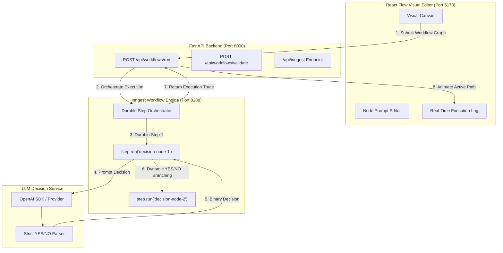

# Task & AI Workflow API (`flyrank-task-api`)

A production-grade REST backend and visual AI workflow engine built with **FastAPI**, **Pydantic**, **SQLite**, **Inngest**, **React Flow**, and the **OpenAI SDK**.

Built for the FlyRank Internship Backend AI Engineering Track:
- **Week 2 (A1)**: In-memory Task CRUD API
- **Week 3 (A2)**: SQLite Database Persistence with Parameterized Queries
- **Week 7 (A1)**: LLM Support Triage with Schema Validation, Single Repair Retry, and Quarantine Observability
- **BE-09**: AI Decision Flow with React Flow + Inngest Orchestration

---

## 🚀 BE-09 — AI Decision Flow with React Flow + Inngest

### 🎯 Assignment Objective
Build a visual AI workflow engine where each node represents an AI decision step evaluated by an LLM that returns strictly **`YES`** or **`NO`**. The workflow is visually authored in **React Flow**, executed as durable steps in **Inngest**, and dynamically traversed based on the model's binary decisions.

```
                    ┌─────────────────────────┐
                    │ Is this a support       │
                    │ request?                │
                    └────────────┬────────────┘
                              YES│NO
                         ┌───────┘ └──────────┐
                         ▼                    ▼
                  ┌─────────────┐      ┌─────────────┐
                  │ Support     │      │ Sales       │
                  │ Node        │      │ Node        │
                  └─────────────┘      └─────────────┘
```

---

### 🏗️ Architecture & Orchestration Flow



---

### 🛠️ Tech Stack

- **Backend**: Python 3.10+, FastAPI, Uvicorn, Pydantic v2
- **Workflow Orchestration**: Inngest Python SDK (`inngest`)
- **AI/LLM**: OpenAI Python SDK (`openai`), OpenRouter, Ollama
- **Database**: SQLite (`sqlite3`) with parameterized queries
- **Frontend**: React 19, TypeScript, Vite, React Flow (`@xyflow/react`), Tailwind CSS v4, Lucide Icons

---

### 📁 Project Structure

```
Building-first-crud-api/
│
├── main.py                     # FastAPI application root & Inngest serve
├── requirements.txt            # Python dependencies
├── pytest.ini                  # Pytest configuration
├── README.md                   # Complete documentation
├── .env.example                # Environment variables template
├── tasks.db                    # SQLite database (auto-generated, git-ignored)
│
├── src/
│   ├── workflow/               # AI Decision Flow Module (BE-09)
│   │   ├── __init__.py
│   │   ├── schema.py           # Pydantic models for nodes, edges, runs
│   │   ├── llm_decision.py     # Binary YES/NO decision engine
│   │   ├── inngest_workflow.py # Inngest functions & dynamic graph traversal
│   │   └── router.py           # API routes (/api/workflows/run, /validate, /templates)
│   └── llm/                    # Support Triage Module (Week 7)
│       ├── client.py
│       ├── schema.py
│       └── service.py
│
├── prompts/
│   └── triage-v1.md            # Versioned support triage prompt
│
├── tests/
│   └── test_workflow.py        # Automated test suite for BE-09 workflows
│
├── evals/
│   ├── cases.json              # Week 7 evaluation benchmark
│   └── run_eval.py             # Evaluation runner
│
└── frontend/                   # React Flow Visual Editor (BE-09)
    ├── package.json
    ├── vite.config.ts          # Vite configuration with API proxy
    ├── index.html
    └── src/
        ├── App.tsx             # Main canvas application
        ├── types/workflow.ts   # TypeScript workflow interfaces
        └── components/
            ├── DecisionNode.tsx    # Custom React Flow decision node
            ├── DecisionEdge.tsx    # Custom YES/NO edge with animated path glow
            ├── NodeEditor.tsx      # Slide-over prompt editor
            ├── ExecutionPanel.tsx  # Real-time execution log & step inspector
            ├── Toolbar.tsx         # Node actions, presets, context input, JSON export
            └── Header.tsx          # Status indicators & metrics
```

---

### ⚙️ Environment Variables

Create your `.env` file from the provided `.env.example`:

```bash
cp .env.example .env
```

| Variable | Description | Default / Example |
|:---|:---|:---|
| `OPENAI_API_KEY` | OpenAI API Key (or OpenRouter key) | `sk-...` |
| `OPENAI_MODEL` | Target LLM model for decision nodes | `gpt-4o-mini` |
| `OPENAI_BASE_URL` | Base URL for OpenAI-compatible provider | `https://openrouter.ai/api/v1` |
| `LLM_STUB` | **Stub Mode**: `1` enables zero-cost deterministic mock responses | `0` (or `1` for testing) |
| `INNGEST_APP_ID` | Inngest Application identifier | `ai-decision-workflow` |
| `INNGEST_DEV_SERVER_URL` | Inngest local development server URL | `http://localhost:8288` |

---

### 🚀 Setup & Local Development

#### 1. Install Backend Dependencies
```bash
pip install -r requirements.txt
```

#### 2. Install Frontend Dependencies
```bash
cd frontend
npm install
cd ..
```

#### 3. Start the FastAPI Backend Server
```bash
uvicorn main:app --reload --port 8000
```
- API Docs (Swagger UI): **[http://localhost:8000/docs](http://localhost:8000/docs)**
- Inngest Endpoint: **[http://localhost:8000/api/inngest](http://localhost:8000/api/inngest)**

#### 4. Start the React Frontend
In a new terminal tab:
```bash
cd frontend
npm run dev
```
- Open your browser at: **[http://localhost:5173](http://localhost:5173)**

#### 5. (Optional) Start Inngest Local Dev Server
To inspect durable steps visually in the Inngest Dev Server dashboard:
```bash
npx inngest-cli@latest dev -u http://localhost:8000/api/inngest
```
- Inngest Dashboard: **[http://localhost:8288](http://localhost:8288)**

---

### 🎨 How to Use the Visual Workflow Editor

1. **Add Decision Nodes**: Click **"+ Add Node"** in the top toolbar to create a new node.
2. **Edit Prompts**: Click **"Edit"** on any node to customize its label, decision prompt, or set it as the starting node.
3. **Connect YES / NO Branches**:
   - Drag from the **green handle (YES)** on the bottom-left of a node to connect to the target branch.
   - Drag from the **red handle (NO)** on the bottom-right of a node to connect to the alternative branch.
4. **Set Evaluation Context**: Click **"Context"** in the toolbar to enter the customer message or scenario (e.g., *"My credit card was charged twice and I need a refund"*).
5. **Run the Workflow**: Click **"▶ Run Workflow"**.
   - Watch the execution path highlight in real-time as each decision node is evaluated by the LLM.
   - Active traversed edges glow in green for `YES` or red for `NO`.
   - Inspect step-by-step decisions, raw model outputs, and timestamps in the **Execution Log** panel.
6. **Import & Export**:
   - Click the **Download** icon to export your workflow graph as a clean JSON file.
   - Click the **Upload** icon to import any saved JSON workflow.
7. **Preset Templates**: Use the **"Templates"** dropdown to instantly load pre-built workflows such as *Customer Support Triage* or *Security & Escalation Gate*.

---

### 📋 Example Workflow JSON Format

```json
{
  "start_node_id": "node-1",
  "input_context": "Customer says: I need help resetting my password.",
  "nodes": [
    {
      "id": "node-1",
      "label": "Is this a support request?",
      "prompt": "Is the user requesting technical assistance, troubleshooting, or help?",
      "is_start": true,
      "position": { "x": 300, "y": 80 }
    },
    {
      "id": "node-2",
      "label": "Password Reset Tier",
      "prompt": "Is the issue related to password reset or account login credentials?",
      "is_start": false,
      "position": { "x": 120, "y": 280 }
    },
    {
      "id": "node-3",
      "label": "Sales & Billing",
      "prompt": "Is the user asking about enterprise pricing or upgrading?",
      "is_start": false,
      "position": { "x": 480, "y": 280 }
    }
  ],
  "edges": [
    {
      "id": "e1-2",
      "source": "node-1",
      "target": "node-2",
      "decision": "YES",
      "source_handle": "yes"
    },
    {
      "id": "e1-3",
      "source": "node-1",
      "target": "node-3",
      "decision": "NO",
      "source_handle": "no"
    }
  ]
}
```

---

### 🧪 Automated Testing

Run the automated backend test suite with Pytest:

```bash
pytest tests/test_workflow.py -v
```

**Test Coverage:**
- ✅ `test_llm_parser_strict_validation`: Strict YES/NO parsing and conversational rejection.
- ✅ `test_yes_branching`: Validates that YES decisions accurately traverse YES edges.
- ✅ `test_no_branching`: Validates that NO decisions accurately traverse NO edges.
- ✅ `test_multi_node_traversal`: Validates multi-step dynamic graph traversal.
- ✅ `test_infinite_loop_prevention`: Validates that cyclical loops terminate safely at the step limit (25).
- ✅ `test_graph_validation`: Validates start node existence, edge references, and duplicate branch warnings.
- ✅ `test_existing_crud_regression`: Confirms all SQLite CRUD endpoints remain 100% operational.
- ✅ `test_existing_triage_regression`: Confirms Week 7 Support Triage endpoint remains 100% operational.

---

### 💡 Deterministic Stub Mode (`LLM_STUB=1`)

To test workflows without consuming OpenAI API credits or when offline:
```bash
export LLM_STUB=1
uvicorn main:app --reload
```
In stub mode, decision nodes evaluate deterministically based on keyword heuristics and return schema-valid `YES` or `NO` answers with zero external network overhead.

---

## 📌 Previous Assignment Documentation (Preserved)

### 🗄️ Task CRUD API (Week 2 & Week 3)

The API persists to-do items to a local SQLite database ([tasks.db](file:///Users/govindnair/Documents/Building%20first%20crud%20api/tasks.db)) using parameterized SQL queries:

| Method | Endpoint | Description | Status Code |
|:---|:---|:---|:---|
| **GET** | `/` | API metadata and feature list | `200 OK` |
| **GET** | `/health` | Health check probe | `200 OK` |
| **GET** | `/tasks` | List all tasks | `200 OK` |
| **GET** | `/tasks/{id}` | Get task by ID | `200 OK` / `404 Not Found` |
| **POST** | `/tasks` | Create task | `201 Created` / `400 Bad Request` |
| **PUT** | `/tasks/{id}` | Update task | `200 OK` / `400 Bad Request` / `404 Not Found` |
| **DELETE** | `/tasks/{id}` | Delete task | `204 No Content` / `404 Not Found` |

### 🤖 LLM Support Triage API (Week 7)

| Method | Endpoint | Description | Status Code |
|:---|:---|:---|:---|
| **POST** | `/triage` | Classifies support message into structured JSON (`category`, `urgency`, `confidence`, `reason`) with single repair retry and quarantine on failure | `200 OK` / `400 Bad Request` / `422 Unprocessable` / `504 Gateway Timeout` |

### 🔄 AI Workflow API (BE-09)

| Method | Endpoint | Description | Status Code |
|:---|:---|:---|:---|
| **POST** | `/api/workflows/run` | Executes an AI Decision Flow with dynamic graph traversal | `200 OK` / `400 Bad Request` / `500 Server Error` |
| **GET** | `/api/workflows/runs` | List history of recent workflow executions | `200 OK` |
| **GET** | `/api/workflows/runs/{id}` | Get specific execution trace and step details | `200 OK` / `404 Not Found` |
| **POST** | `/api/workflows/validate` | Validates workflow graph structure and connectivity | `200 OK` |
| **GET** | `/api/workflows/templates` | Retrieve pre-built workflow templates | `200 OK` |
| **ALL** | `/api/inngest` | Inngest SDK serve endpoint for durable function execution | `200 OK` |
