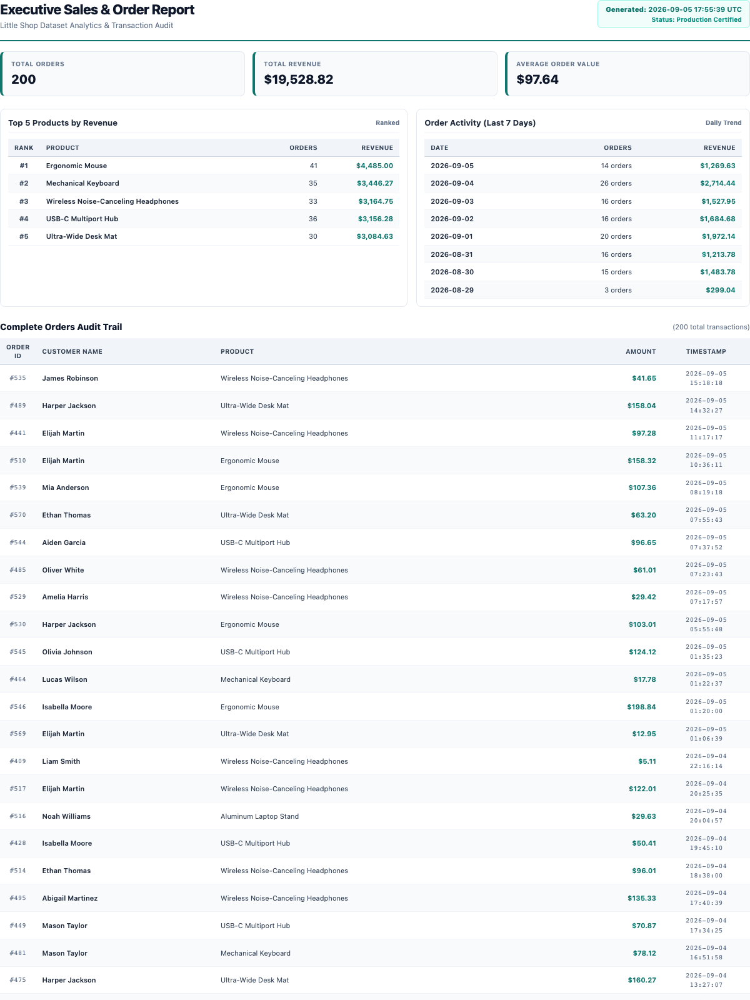

# PDF Report Generator (`pdf-report-generator`)

A complete data-to-PDF reporting pipeline built with **FastAPI**, **SQLite**, and **Playwright + Headless Chromium**. Built for the FlyRank Internship Backend AI Engineering Track (Assignment A8).

---

## 📌 Overview

This project implements an end-to-end data reporting and PDF generation pipeline that transforms raw relational database records into a multi-page executive PDF document with clean page breaks and repeating table headers.

```
SQLite Orders Dataset
        ↓
SQL Aggregation (COUNT, SUM, GROUP BY, ORDER BY, LIMIT)
        ↓
HTML & Print CSS Template
        ↓
Playwright Headless Chromium Engine
        ↓
Physical PDF Artifact Saved to Disk (reports/{id}.pdf)
        ↓
SQLite Stores PDF File Path Metadata
        ↓
FastAPI Serves PDF via Binary Stream Link (GET /reports/{id}/file)
```

---

## 🛠️ Tech Stack

- **Python 3.10+**
- **FastAPI**: Modern web framework for REST API endpoints.
- **SQLite (`sqlite3`)**: Relational database storing shop orders and report metadata.
- **Playwright (Python)**: Headless browser automation executing headless Chromium for PDF rendering.
- **Pydantic**: Data schema validation and typing.
- **Uvicorn**: High-performance ASGI web server.

---

## 📦 Little Shop Dataset

The reporting engine operates over a shop transaction database stored in `report.db`:

- **Table**: `orders`
- **Schema**:
  ```sql
  CREATE TABLE IF NOT EXISTS orders (
      id INTEGER PRIMARY KEY AUTOINCREMENT,
      customer TEXT NOT NULL,
      product TEXT NOT NULL,
      amount REAL NOT NULL,
      created_at TEXT NOT NULL
  );
  ```
- **Volume**: Exactly **200 orders** across 6 product lines (`Wireless Noise-Canceling Headphones`, `Mechanical Keyboard`, `Ergonomic Mouse`, `Ultra-Wide Desk Mat`, `Aluminum Laptop Stand`, `USB-C Multiport Hub`) with amounts ranging from **$5.00 to $200.00** spanning the last 30 days.

---

## 🚀 Setup & Installation

1. **Navigate to the assignment directory**:
   ```bash
   cd pdf-report-generator
   ```

2. **(Optional) Create and activate a virtual environment**:
   ```bash
   python3 -m venv .venv
   source .venv/bin/activate   # On Windows: .venv\Scripts\activate
   ```

3. **Install Python dependencies**:
   ```bash
   pip install -r requirements.txt
   ```

4. **Install the Playwright Chromium browser**:
   ```bash
   playwright install chromium
   ```

---

## 🌾 Seeding the Database

Populate the `orders` table with 200 realistic shop transactions:

```bash
python seed.py
```

> **Idempotency Guarantee:**  
> The seed script cleans existing order records prior to insertion (`DELETE FROM orders`). Running `python seed.py` multiple times always results in a clean 200-row dataset without duplicating records.

---

## ▶️ Running the API Server

Start the FastAPI application:

```bash
uvicorn main:app --reload --port 8000
```

The server will initialize `report.db` tables automatically and listen at: `http://localhost:8000`

---

## 📖 API Endpoints

| Method | Endpoint | Description | Status Code |
|:---|:---|:---|:---|
| **GET** | `/health` | Service health check probe | `200 OK` |
| **POST** | `/reports` | Generate a new daily report or retrieve existing cached report | `201 Created` / `200 OK` |
| **GET** | `/reports/{id}` | Retrieve report metadata and download link | `200 OK` / `404 Not Found` |
| **GET** | `/reports/{id}/file` | Stream and download the physical PDF file | `200 OK` / `404 Not Found` |

---

## 📊 SQL Aggregation Queries

The report data is computed using actual SQL aggregation queries implemented in [report_queries.py](report_queries.py):

### 1. Total Orders & Total Revenue
```sql
SELECT 
    COUNT(*) AS total_orders, 
    COALESCE(SUM(amount), 0.0) AS total_revenue 
FROM orders;
```

### 2. Top 5 Products by Revenue
```sql
SELECT 
    product, 
    ROUND(SUM(amount), 2) AS revenue, 
    COUNT(*) AS order_count
FROM orders
GROUP BY product
ORDER BY revenue DESC
LIMIT 5;
```

### 3. Orders Per Day (Last 7 Days)
```sql
SELECT 
    DATE(created_at) AS order_date,
    COUNT(*) AS order_count,
    ROUND(SUM(amount), 2) AS daily_revenue
FROM orders
WHERE created_at >= DATETIME('now', '-7 days')
GROUP BY DATE(created_at)
ORDER BY order_date DESC;
```

### 4. Complete Orders Audit Trail
```sql
SELECT id, customer, product, ROUND(amount, 2) AS amount, created_at
FROM orders
ORDER BY created_at DESC;
```

---

## 📄 PDF Generation & Clean Page Breaks

PDF generation uses Playwright to render an HTML document in headless Chromium and export it to an A4 PDF (`print_background=True`).

### ✂️ Print CSS for Page Break Handling
To guarantee that table rows are never cut in half across page margins and that table headers repeat seamlessly on subsequent pages:

```css
/* Ensure table headers repeat at the top of each printed page */
thead {
    display: table-header-group;
}

/* Prevent cutting individual table rows in half across page breaks */
tr {
    break-inside: avoid;
    page-break-inside: avoid;
}

/* Configure standard A4 page dimensions and margins */
@page {
    size: A4;
    margin: 16mm 14mm 18mm 14mm;
}
```

With 200 order rows, the generated PDF spans **11 pages** with clean pagination and zero split rows.

---

## 🔄 Once-Per-Day Idempotency

- **Standard Execution**: `POST /reports` checks if a report has already been created today in SQLite (`DATE(created_at) = DATE('now')`). If found, it returns **`HTTP 200 OK`** with the existing report link, generating **0 new PDF files**.
- **Forced Regeneration**: Sending `{"force": true}` skips the daily check, generates a fresh PDF, and returns **`HTTP 201 Created`** with a new report ID.

---

## 🧪 Real Execution Proof & `curl` Examples

### 1. Initial Report Generation (`POST /reports`)
```bash
curl -i -X POST http://localhost:8000/reports
```
**Output (`201 Created`):**
```http
HTTP/1.1 201 Created
content-type: application/json

{
  "id": 1,
  "file": "/reports/1/file",
  "created_at": "2026-09-05 17:53:48",
  "is_cached": false
}
```

### 2. Retrieve Report Metadata (`GET /reports/1`)
```bash
curl -i http://localhost:8000/reports/1
```
**Output (`200 OK`):**
```http
HTTP/1.1 200 OK
content-type: application/json

{
  "id": 1,
  "file": "/reports/1/file",
  "created_at": "2026-09-05 17:53:48"
}
```

### 3. Download the PDF File (`GET /reports/1/file`)
```bash
curl -i http://localhost:8000/reports/1/file --output sales-report-1.pdf
```
**Output (`200 OK`, Binary PDF stream):**
```http
HTTP/1.1 200 OK
content-type: application/pdf
content-disposition: attachment; filename="sales-report-1.pdf"
content-length: 322224
```

### 4. Duplicate Request on Same Day (`POST /reports`)
```bash
curl -i -X POST http://localhost:8000/reports
```
**Output (`200 OK`, Idempotent Cache Hit):**
```http
HTTP/1.1 200 OK
content-type: application/json

{
  "id": 1,
  "file": "/reports/1/file",
  "created_at": "2026-09-05 17:53:48",
  "is_cached": true
}
```

### 5. Force New Report Generation (`POST /reports` with `force=true`)
```bash
curl -i -X POST http://localhost:8000/reports \
  -H "Content-Type: application/json" \
  -d '{"force": true}'
```
**Output (`201 Created`, New Report ID):**
```http
HTTP/1.1 201 Created
content-type: application/json

{
  "id": 2,
  "file": "/reports/2/file",
  "created_at": "2026-09-05 17:53:50",
  "is_cached": false
}
```

---

## ⚡ Stage 4 Background Job Consideration

> **When to transition to background jobs:**  
> If report datasets grow into tens of thousands of rows or when many users request reports simultaneously, report generation should be moved outside the synchronous HTTP request cycle into an asynchronous background job queue (such as Inngest or Celery) returning `202 Accepted` immediately.

---

## 🖼️ Generated PDF Screenshot

Below is the visual render of Page 1 of the generated Executive Sales Report:



---

## 🧪 Automated Test Suite

Run the full automated test suite covering all 27 verification points:

```bash
pytest pdf-report-generator/tests/test_pdf_report.py -v
```

**Results:**
- ✅ Health endpoint probe (`200 OK`)
- ✅ Idempotent 200-row seed dataset verification
- ✅ SQL Aggregations (Total orders, revenue, top 5 products, daily volume)
- ✅ Playwright PDF rendering and multi-page validation (`len(pages) >= 2`)
- ✅ API report lifecycle (`POST` 201 → `GET` metadata 200 → `GET /file` binary 200)
- ✅ Once-per-day idempotency (`POST` 200 on duplicate, `POST` 201 on `force=true`)
- ✅ Parent project regression checks (Task CRUD, LLM Triage, BE-09 React Flow)
